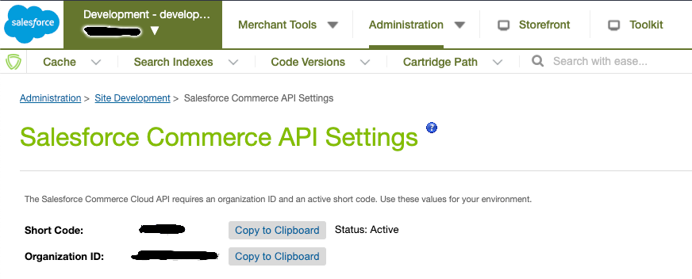
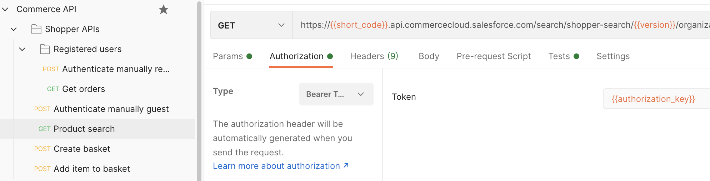
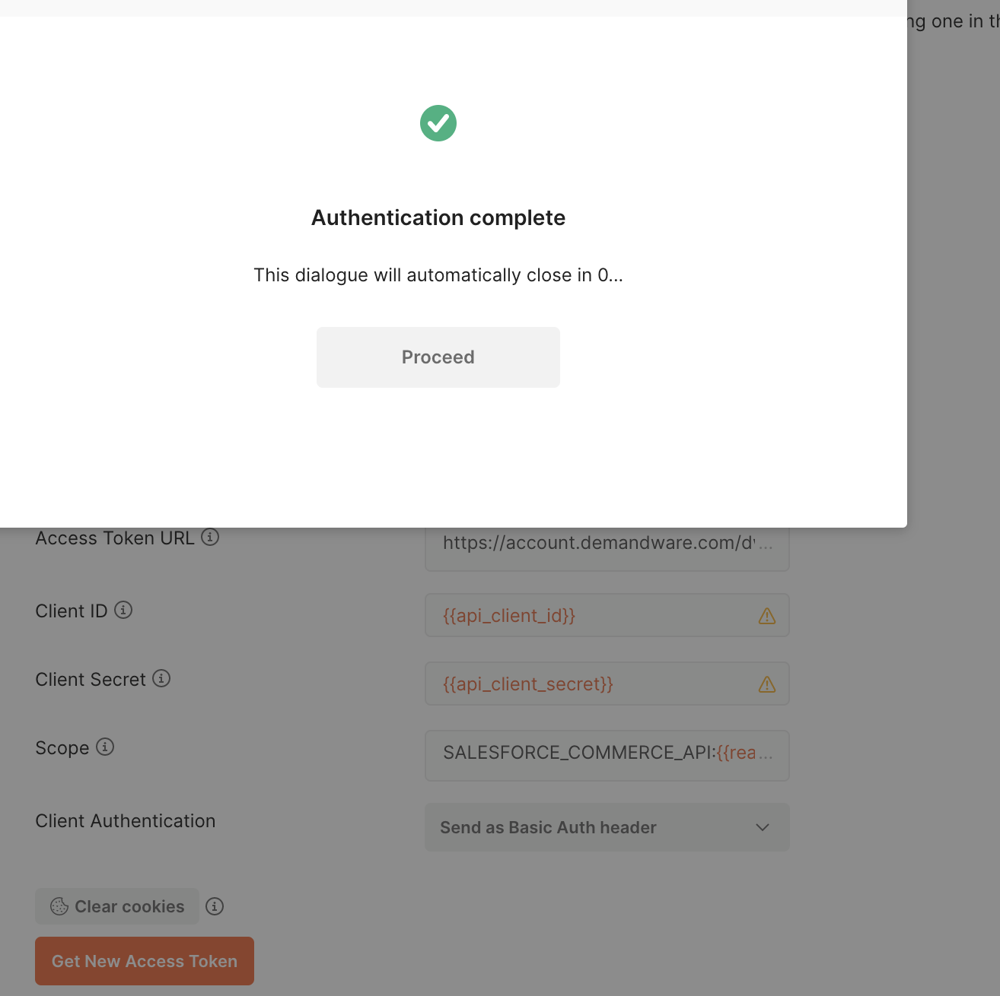

Emakina.FR - Salesforce Commerce API Postman
===========================

📦 Installation
---------------

First, download and open Postman: https://www.postman.com/downloads/

Then click on "File > Import..." and import both files:
* Commerce API.postman_collection.json
* Commerce API.postman_environment.json

You should see a "Commerce API" collection, select the "Commerce API" environment on the top right of the window. If 
you are not familiar with Postman you should look at its documentation.

Go to [Account Manager](https://account.demandware.com/) and create a new API Client with "Salesforce 
Commerce API" role. Don't forget to add the wanted permissions on your Client API, following the [official 
documentation](https://developer.commercecloud.com/s/article/CommerceAPI-AuthZ-Scope-Catalog)

You should have a Client API and Client password. Now you have to get the Short Code and the Organization ID 
by going to the Business Manager of the wanted platform. Go to "Administration > Site Development > Salesforce 
Commerce API Settings" to get it:

Back to Postman, edit your environment variables (the "Commerce API" environment you've imported above) with your 
data:
* `api_client_id`: the API Client ID (created above)
* `api_client_secret`: the API Client pasword (created above)
* `short_code`: data that you got in your Business Manager
* `realm_id`: part of the Organization ID that you've got in your Business Manager (f_ecom_{realm_id}_{instance_id})
* `instance_id`: part of the Organization ID that you've got in your Business Manager (f_ecom_{realm_id}_{instance_id})
* `permissions`: the permissions you want to use (also set in your API Client)
* `site_id`: put the site ID you want to query (“Administration >  Sites >  Manage Sites” in your Business Manager)
* `website_user_login` / `website_user_pwd`: if you want to use this collection to make calls for a registered user, set these variables

🚀 Usage
--------

If you don't know how Commerce API works you should first learn it on the 
official website, especially the [authentication part](https://developer.commercecloud.com/s/article/CommerceAPI-Authentication) and 
the distinction between "Shopper APIs" and "Management APIs"

#### Shopper APIs

If you want to use "Shopper APIs" the collection gives you ways to get a token for both registered and guest users. Select for example 
"Authenticate manually guest" API call and click on "Send" button. You should see the API answer. These 2 authentications ("Authenticate 
manually registered" and "Authenticate manually guest") have code in "Tests" tab that will save the returned `customerId` to a new environment 
variable so that you don't have to copy paste it for other calls such as "Product search" for example:

#### Management APIs

It's a little bit different for Management APIs that use OAuth for authentication. To authenticate you have to select the "Management APIs" 
folder. Then if you scroll you should see the button to query a new token. If you click on it you will see this screen:

Select the new token and now you can use all API that are under this folder! You also have a manual 
way to authenticate ("Authenticate manually") but it's only there so that you know how it's done bbehind the scene (if you want to develop the 
authentication in your favorite programming language for example) but not useful in this Posman collection.

🤝 Contributing
---------------
Contributions, issues and feature requests are welcome!  
By the way, don't forget you can give a ⭐️ if this project helped you!

📝 License
----------
Copyright © [Emakina](https://www.emakina.fr/). This project is licensed under the [MIT](/LICENSE) license.
